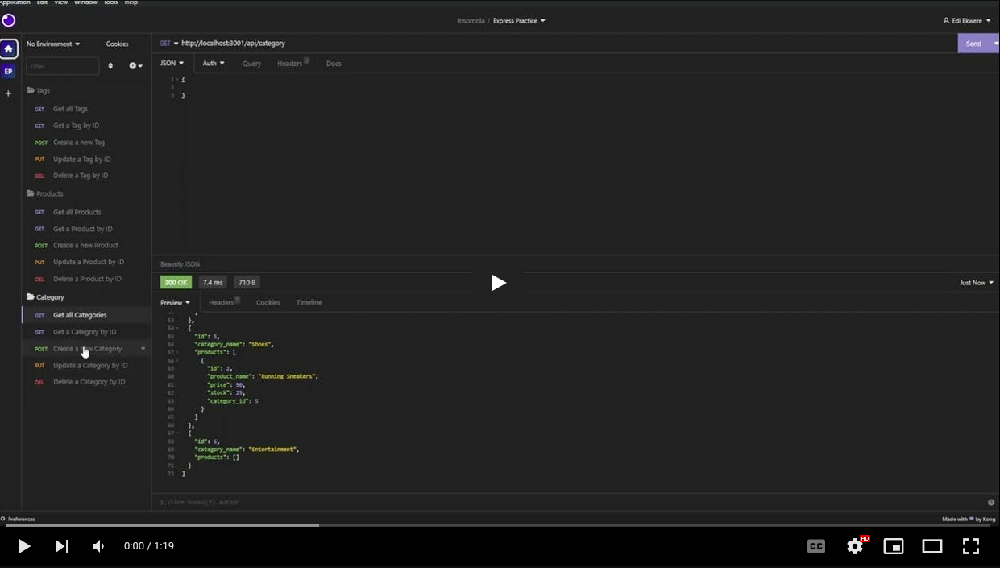
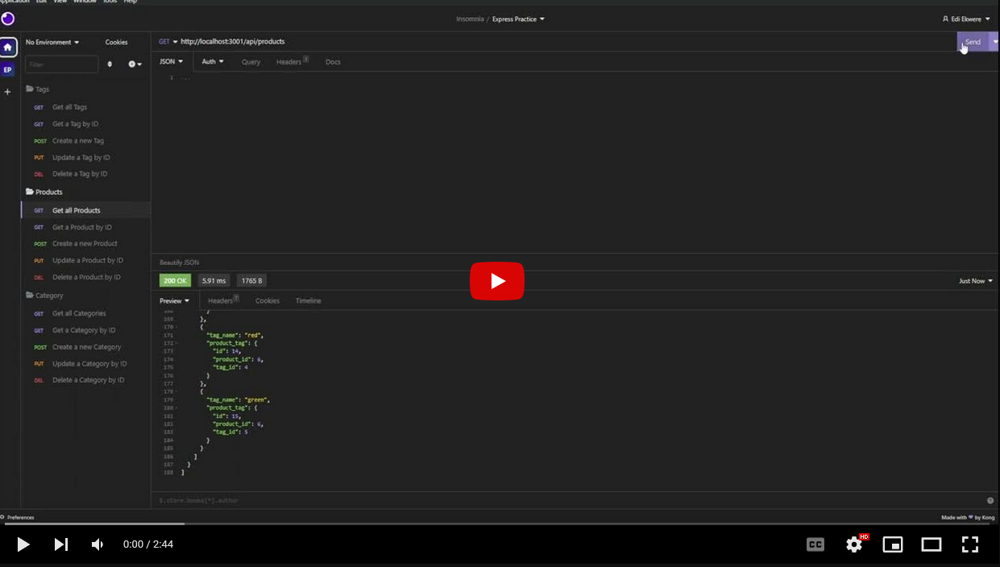
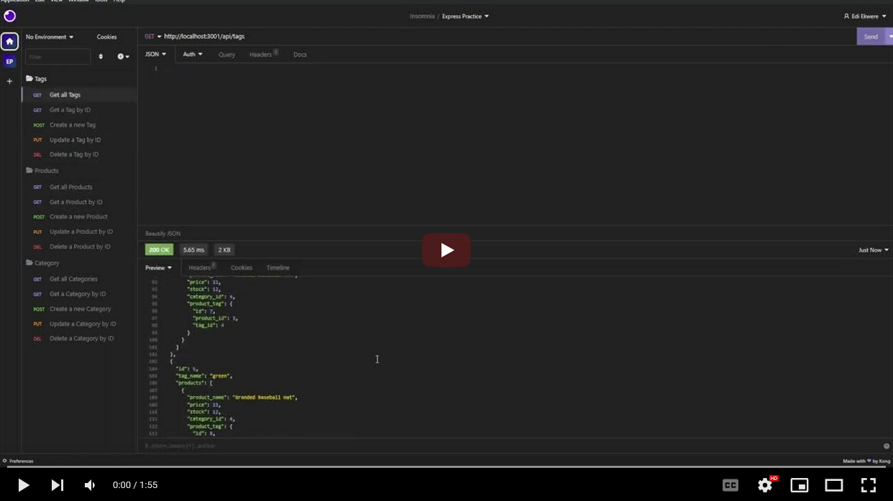

# E-Commerce-Back-End

A Backend API for an E-Commerce website
  

  
## Description
  
A NodeJS and MySQL powered E-Commerce Back End. It utilizes several key npm technologies.
  
## Table of Contents
  
- [Installation](#installation)
- [Usage](#usage)
- [License](#license)
- [Contributing](#contributing)
- [Media](#media)
- [Credits](#credits)
  
## Installation
  
- Clone the repo to your local storage.
- Open the folder in a git bash or powershell terminal.
- Run `npm i` to install the necessary packages.
- Run the mySQL command: `mysql -u root -p` and then run `SOURCE schema.sql` to start a DB.
- Exit out of mySQL with `quit`
- Run `node seeds/index.js`
- Run `node server.js` to start the backend.

## Technologies


- NPM Express
- NPM dotenv
- NPM mySQ12
- NPM Inquirer
- NPM Sequelize
  
## Usage

Going to start doing them like this from now on.

Upon running node index.js in a terminal, the user will be allowed to access the database using a program like Insomnia. The API will take GET, POST, PUT, and DELETE calls for different params.

```
AS A manager at an internet retail company
I WANT a back end for my e-commerce website that uses the latest technologies
SO THAT my company can compete with other e-commerce companies
```

```
GIVEN a functional Express.js API
WHEN I add my database name, MySQL username, and MySQL password to an environment variable file
THEN I am able to connect to a database using Sequelize
WHEN I enter schema and seed commands
THEN a development database is created and is seeded with test data
WHEN I enter the command to invoke the application
THEN my server is started and the Sequelize models are synced to the MySQL database
WHEN I open API GET routes in Insomnia Core for categories, products, or tags
THEN the data for each of these routes is displayed in a formatted JSON
WHEN I test API POST, PUT, and DELETE routes in Insomnia Core
THEN I am able to successfully create, update, and delete data in my database
```

## License
  
This project is covered under the MIT license.
  
## Contributing
  
N/A
  
## Media

Click to watch the full video on YouTube!

  [](https://youtu.be/Sdg4MHNV_OU)
  [](https://youtu.be/yoo1-1VMb34)
  [](https://youtu.be/Ap-swvuhBpc)

## Credits

  Ediubong Ekwere | JunoAndIce

  <https://github.com/JunoAndIce> | [ekwere.edi@gmail.com](mailto:ekwere.edi@gmail.com)
  